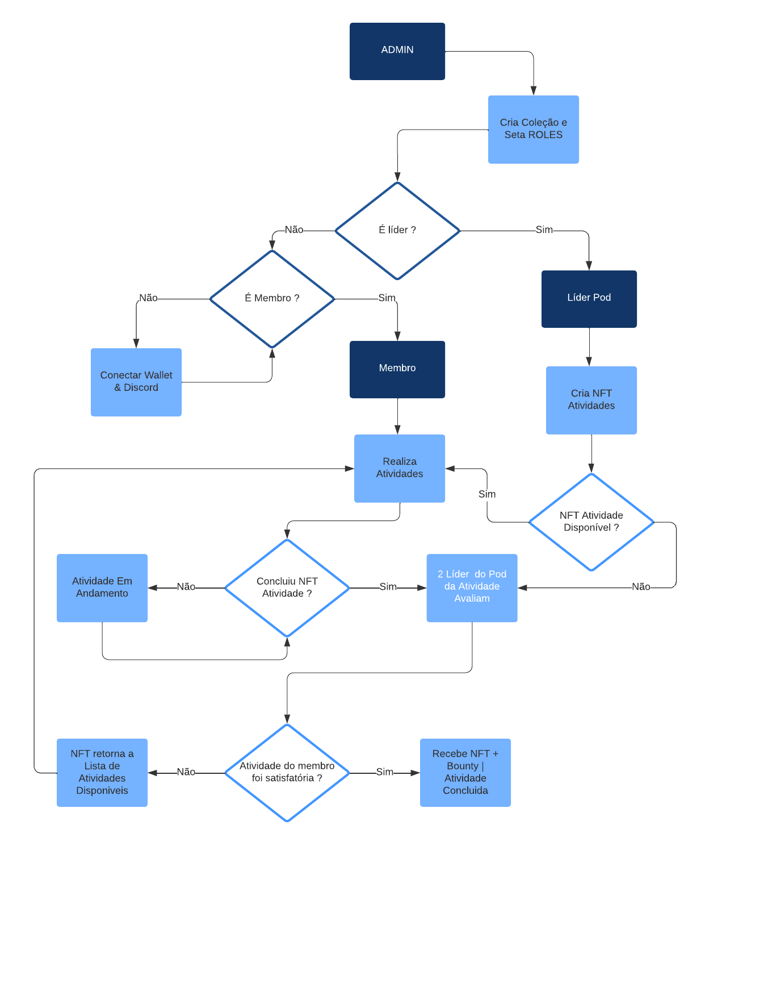
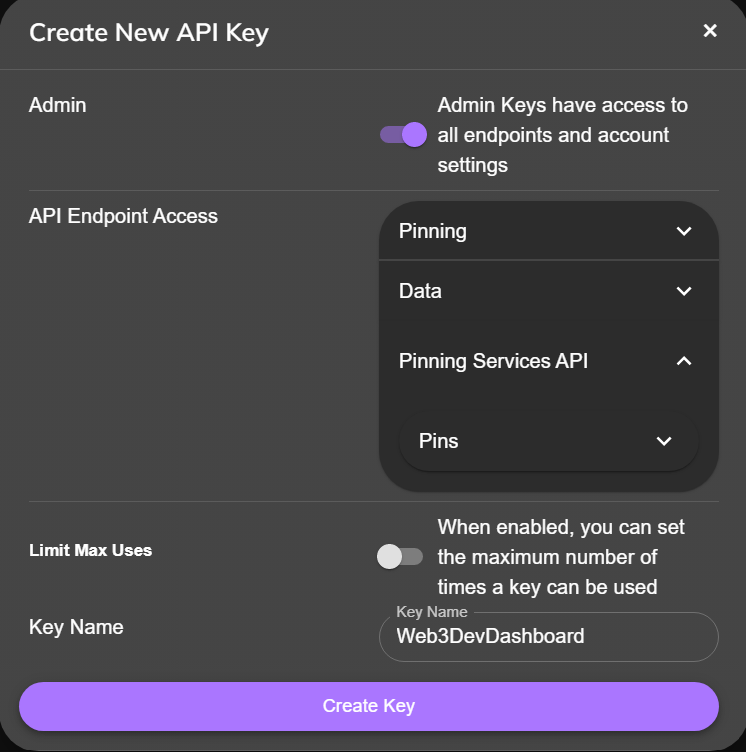
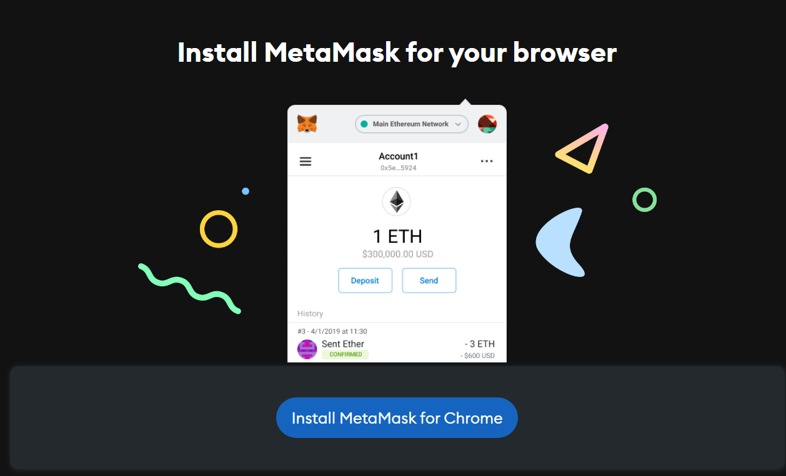
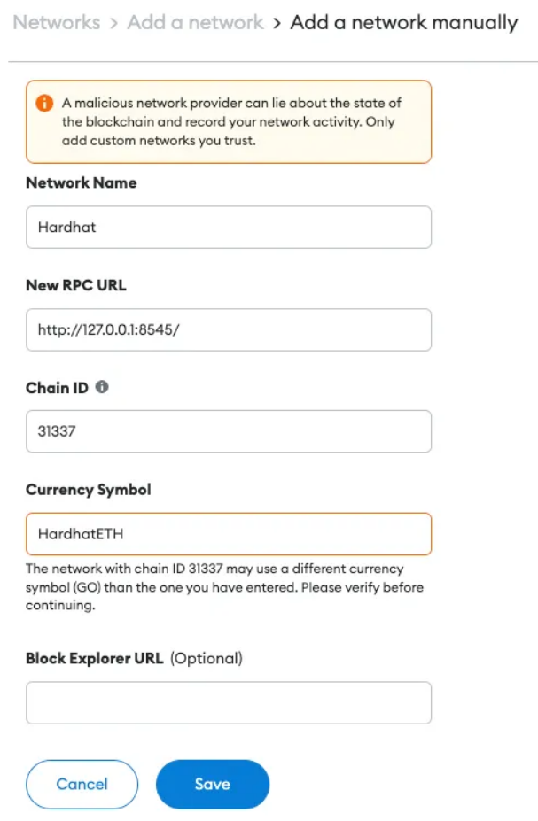

## Os participantes devem entrar na branch com o "NOME DA EQUIPE", editar o arquivo "README.md" com os campos aqui postos e submeter um PR (pull request) do seu projeto para serem avaliados corretamente pela comissão do Hackathon.

#### [Edital do Hackathon](https://docs.web3dev.com.br/pods/hackathon-pod-labs/edital-geral)

#### [Edital dos Temas e Premiações](https://docs.web3dev.com.br/pods/hackathon-pod-labs/edital-dos-temas)

```
Nome da equipe: unidosdoethsamba

Nome dos integrantes: Daniel Vianna & Heron Lancellot

Grants aplicados:
UX/UI Design (R$700)

1. Melhor layout geral (R$400).
2. Melhores componentes e botões animados (R$180).
3. Melhores ícones, paletas, imagens e tipografia (R$120).

Front-end (R$1000):

4. Melhor código de front-end do Marketplace de Atividades (R$1000).

Solidity (js/ts) (R$1300):

5. Melhor fluxograma do “Marketplace de Atividades” (R$150).

6. Melhor script/interface para fazer upload de metadados no IPFS (R$75).

7. Melhor script/interface de criação de especificações de metadados (NFTs das atividades) (R$75).

8. Melhor contrato inteligênte e atendimento às funcionalidades propostas (R$1000):

```

```
Nome do projeto:  Web3Dev Admin Activities Dashboard
Pitch:
```
## Arquitetura do sistema


## Tecnologias

Esse projeto foi desenvolvido usando as seguintes tecnologias:

- React
- TypeScript
- Node Js
- IPFS
- Solidity
- Hardhat
- Mui
- Wagmi
- Ethers.js
---

Descrição do produto:

Como testar/compilar o produto:

## Rodar Aplicação

Para testar/compilar é necessário ter o Node Js instalado na máquina.

Pré-requisito Instalação:

- Node Js
- Gateway IPFS( IPFS Desktop, PINATA, INFURA, Cloudfare IPFS...)
  - Iremos utilizar o PINATA no exemplo abaixo.

# Variáveis de ambiente

É necessário setar as seguintes variávei de ambiente no sistema:
- Na pasta frontend/ crie um arquivo .env

```
  REACT_APP_PINATA_AUTH = 'Bearer <SENHA>'
  REACT_APP_PINATA_API_SECRET = '<SENHA>'
  REACT_APP_PINATA_API_KEY = '<SENHA>'
  REACT_APP_IPFS_GATEWAY='https://gateway.pinata.cloud/ipfs/'
  REACT_APP_ERC721_METADATA_EXTERNAL_LINK = 'https://github.com/seu-nome/'
  REACT_APP_DAPP_CONTRACT = "<Endereço do Contrato Deployado>"
```

## Frontend
- Crie um arquivo .env em frontend

- PINATA 
  ## 1. Login [PINATA](https://www.pinata.cloud/)
    
    

  ## 2. Clique em API Keys.
      
    
  
  ## 2.1 Clique em NEW KEY para Criar uma nova API KEY.
    
    
    
  ## 2.2 Marque a opção "ADMIN" e adicione um KEY Name, sugestão "Web3DevDashboard" após isso clique em Create Key para criar sua nova chave ! 
    

      - Create New API Key > Marque a opção "ADMIN KEY"
      - Key Name: Escolha um nome ~ Sugestão: Web3DevDashboard 
      - Clique em CREATE KEY
  
  ## 3. API Key Info
    - As Chaves só aparecem nessa tela não esqueça de copiar !
      - Exemplo: 

        

  ## 3.1 Adicione as chaves que aparecem na sua tela no arquivo .env criado no frontend. 
  ## **Lembre-se de nunca commitar ou enviar esses dados para o Github ! O exemplo acima é apenas para instrução.**
            
    ## 

      - API Key: 
          ``` 
          No arquivo .env
          - REACT_APP_PINATA_API_KEY = "Coloque a senha aqui"
          ```
      - API Secret
          ```
          No arquivo .env
          - REACT_APP_PINATA_API_SECRET = "Coloque a senha aqui"
          ```
      - JWT
          ```
          No arquivo .env
          Adicione a palavra "Bearer " e coloque a senha
          - REACT_APP_PINATA_AUTH = "Bearer Coloque a senha aqui"
          Atenção ao espaço após Bearer !
          ```

  ## 4. CONTRACT
     - Prossiga com as configurações .env
  ## 4.1. ERC721-METADATA-LINK
    - É adicionado um link externo ao líder que mintar o NFT no metadata
      - Copie o link do seu github e adicione: 
        - Exemplo:
          

        ``` 
        No arquivo .env
        - REACT_APP_ERC721_METADATA_EXTERNAL_LINK = "https://github.com/seu-profile"

        ```
  ## 4.2. Pinata Gateway
    - Aqui você tem a 'porta de entrada' para o IPFS, na qual enviamos os metadados do NFT.

      - Adicione o seu Pinata GATEWAY
            


      - Adicione no arquivo .env
          ``` 
          No arquivo .env
          - REACT_APP_IPFS_GATEWAY='https://gateway.pinata.cloud/ipfs/'

          ```

  ## 4.3. Endereço do Contrato
    - Aqui você deve alterar o endereço do contrato ao deployar o mesmo posteriormente.
      - Exemplo:
        

      - Adicione aqui o endereço do contrato deployado
          ``` 
          No arquivo .env
          - REACT_APP_DAPP_CONTRACT="<Coloque Aqui Após rodar 'npm run deploy mais a frente>"

          ```

## Interagindo com o Marketplace


- Pré-requisitos

  ## 1 [Baixe a sua Wallet Metamask](https://metamask.io/)

    ## 1.1 Clique em Download
     
    

    ## 1.2 Clique em "Install Metamask for Chrome" para instalar a extensão da Metamask no Chrome

    

    ## 1.3 Clique em "Usar no Chrome" para adicionar a Metamask 

    
    
    ## 1.4 Clique em "Adicionar extensão" para adicionar a Metamask 

    

    ## 1.5 Clique em "Criar uma nova carteira" e aceite os termos "I agree to Metamask's Termos de Uso" para criar uma nova carteira

    

    ## 1.6 Clique em "I agree" se concorda com a coleta de dados ou "No Thanks" se não deseja a coleta de dados para melhorar a Metamask
    

    ## 1.7 Crie sua senha. Ela deve ser forte e anotada em um papel para que você possa recuperar caso esqueça.
    - Metamask não se responsabiliza e não é possível recuperar sua senha caso você não anote. **Não pule essa etapa**.

    
    
    ## Recomendações adicionais **IMPORTANTE !** 
      1. Recomendado anotar em um papel, pois o armazenamento de sua Wallet fora da rede é uma segurança adicional e indispensável para que não ocorra a perda dos seus fundos, caso seus dados estejam comprometidos ! 

      2. Contas de Desenvolvimento normalmente não são utilizadas para fins de investimentos, caso necessário, crie outra wallet para esse fim.

      3. Nunca envie o arquivo .env para o github, adicione ao gitignore para não correr esse risco.
    
    ## 1.8 Clique em "Proteger minha carteira (recomendado)"

    

    ## 1.9 Anote sua Frase de Recuperação Secreta na ordem especificada para recuperaração futura de sua conta quando necessário

    

    ## Recomendações adicionais **IMPORTANTE !** 
      1. Recomendado anotar em um papel, pois o armazenamento de sua Wallet fora da rede é uma segurança adicional e indispensável para que não ocorra a perda dos seus fundos, caso seus dados estejam comprometidos ! 

      2. Contas de Desenvolvimento normalmente não são utilizadas para fins de investimentos, caso necessário, crie outra wallet para esse fim.

      3. Nunca envie o arquivo .env para o github, adicione ao gitignore para não correr esse risco.
      

    ## 1.10 Adicione as palavras nos números indicados.

    

    ## 1.11 Carteira criada com sucesso ! 
    

    ## 1.12 Clique no botão de extensão no Google Chrome, após isso clique no ícone de "Fixar" que aparce após a "Metamask".

    

    ## 1.13 Pronto! Metamask Fixada
    - Isso irá facilitar futuramente o desenvolvimento

      

    ## 1.14 Clique no ícone da metamask fixado para visualizar sua conta
    - Exemplo:

      

    # Metamask Configurada com sucesso !

  ## 2 Agora iremos configurar a rede Local Host Hardhat na Metamask 
    
    ## 2.1 Clique em "Add Network" para adicionar a rede que iremos configurar 
    

    ## 2.2 Adicione essas informações na nova rede:

    
       
    ```
    Network Name: Hardhat
    New RPC URL: http://127.0.0.1:8545/ — O ponto de acesso retornado ao rodar o nó local do hardhat
    Chain ID: 31337 —  ID Padrão do Hardhat,
    Currency Symbol: HardhatETH — Defina um simbolo que irá aparecer no seu LocalHost do Hardhat
    ```

  ## 3  Instale os Pacotes

    ## 3.1 Instale os pacotes através do **NPM**
    - Na raiz do projeto, rode no terminal:
        ```
        npm install
        ```
    - Após isso, entre na pasta Frontend
      ```
        cd frontend  
      ```
    - Na pasta frontend, rode no terminal:
      ```
        npm install
      ```

    ## 3.2. Entre na pasta frontend

    ```
        cd frontend
    ```

    ## 3.3. Inicialize a aplicação

    ```
        npm run start
    ```

    ## 3.4 Entre na pasta contracts/

    ```
        cd contracts
    ```

    ## 3.5 Inicialize o Nó Local do Hardhat

    ```
        npx hardhat node
    ```

  ## 4 Adicione o seu endereço na role de Líder e Membro

  ## 4.1 Crie uma nova conta na sua Wallet
  
  - Clique em "Criar conta e adicione uma segunda conta"
  - Será importante para a experiência de LEADER/MEMBER na aplicação 
        
      

  
  ## 4.2 Entre na pasta scripts/deployment/deployNftERC721.js
   
    - Para obter o seu endereço, veja na sua Metamask:
        
        
      - Clique no endereço para copiar "0x....."

  - Altere o endereço em .grantRole(LEADER_ROLE, "<Endereço da Conta 1>")
  - Altere o endereço em console.log(New role LEADER_ROLE to address "<Endereço da Conta 1>, LEADER_ROLE")

  - Altere o endereço em .grantRole(MEMBER_ROLE, "<Endereço da Conta 2>")
  - Altere o endereço em console.log(New role MEMBER_ROLE to address "<Endereço da Conta 2>, MEMBER_ROLE")      

     


# Interaja com o contrato criando/queimando uma atividade através do Frontend e também alterando a ROLE nos scripts para ter a experiência de ser um membro e Líder da WEB3DEV

  ## 5.1 Na pasta contracts/ rode o comando:

  ```
      npm run deploy
  ```
  - Após executar o comando de deploy, anote o endereço do contrato deployado NFT (ERC-721) contract address:  
  
  

  ## 5.2. Configure o .env (REACT_APP_DAPP_CONTRACT)

  

  ```
  REACT_APP_DAPP_CONTRACT = <Coloque o endereço do Contrato Deployado aqui>
  ```

  ## 5.3 Envie faucet para seu endereço:

  ```
    npx hardhat faucet <Coloque o endereço da sua Wallet Aqui >
  ```

## Importante !
```
Para a aplicação funcionar é necessário alterar a ROLE em deployment/deployNftERC721.js com o seu endereço, recomendável ter duas contas para experiência de ser LEADER e MEMBER na comunidade Web3Dev
Exemplo:    
await erc721.grantRole(LEADER_ROLE, "<Coloque seu Endereço aqui>")

Agora envie o Faucet para esse endereço, Lembrando que apenas o LEADER consegue realizar o MINT e o BURN do NFT.

O IPFS Gateway é importante para renderizar suas NFTs na aplicação,caso você utilize outro Gateway como o IPFS DESKTOP, deve-se alterar no .env em IPFS Gateway com suas respectivas variáveis de ambiente. 
Caso o NFT não esteja renderizando, teste outros gateways, exemplos:

REACT_APP_IPFS_GATEWAY='https://cloudflare-ipfs.com/ipfs/'
REACT_APP_IPFS_GATEWAY='https://gateway.ipfs.io/ipfs/'
REACT_APP_IPFS_GATEWAY='https://gateway.pinata.cloud/ipfs/'

Com DESKTOP IPFS 
REACT_APP_IPFS_GATEWAY='http://127.0.0.1:8080/ipfs/'

```
- Caso o nó do Hardhat esteja com muitos blocos e esteja com erro no mint dos NFTs, sugestão:
  1. Na rede Hardhat Localhost em Avançado, clique em "Clear activity and nonce data"
    
    - Dessa forma, o histórico da conta será zerado, rode novamente a aplicação ! 
---

## Testes Locais no Hardhat

## Com a aplicação já deployada:
```
  npm run deploy
```

1. Inicialize o nó local do HARDHAT, caso não esteja inicializado:
    ```
      npx hardhat node
    ```

2. Após isso, para realizar os testes locais no Hardhat
    - Rode esse comando em contracts/ no terminal:

    ``` 
      npx hardhat test
    ```


```
Dificuldades:

Dificuldade maior foi em conseguir utilizar a biblioteca wagmi para realizar as interações com o contrato. 
O multi-sig acabou que não conseguimos nos dedicar o tanto quanto queríamos, pois ficamos muito tempo com problemas relativamente básicos de load de páginas com o React Hooks.

Visão de Futuro:

Ajustar o loading da página principal com os cards do marketplace.
Acredito que após essa experiência, para o futuro nos cabe finalizar o desenvolvimento do multi-sig e então validar o processo de aprovação da conclusão das atividades pelos lideres. 
Implementar a transação de compra da atividade pelo membro.

```
## Licença

Distributed under the MIT License. See `LICENSE` for more information.

## Colaboradores

<table>
  <tr>
    <td align="center">
      <a href="https://www.linkedin.com/in/daniel-vianna-431a0932/">
        <br>
        <sub>
          <b>Daniel Vianna</b>
        </sub>
      </a>
    </td>
    <td align="center">
      <a href="https://www.linkedin.com/in/heron-lancellot">
        <br>
        <sub>
          <b>Heron Lancellot</b>
        </sub>
      </a>
    </td>
  </tr>
</table>
